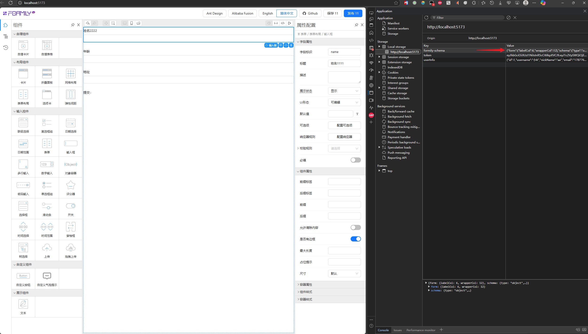

[../src/pages/HowToUse/schema.json](../src/pages/HowToUse/schema.json) 这个文件里的来源如下



到 [../../../formily/antd/](../../../formily/antd/) 目录下，执行

```bash
pnpm start
```

到浏览器打开 [http://localhost:5173/](http://localhost:5173/) ，即可看到如上截图界面
